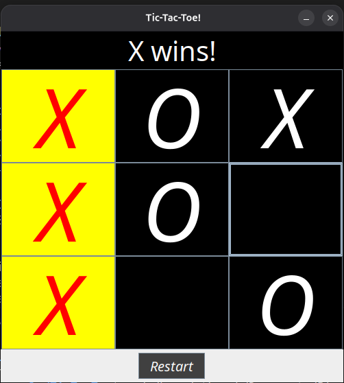

# Tic Tac Toe - Java Game 🕹️

A simple **Tic Tac Toe** game built with **Java Swing**. Two players (X and O) play alternately in a GUI-based 3x3 grid. The game detects wins, highlights them, and allows restarts.

---




---
## 💡 Features

- ✅ Turn-based two-player gameplay
- 🎨 GUI built with Java Swing
- 🟩 Highlights winning tiles
- 🔁 Restart support
- ❌ Handles invalid moves

---

## 🛠️ Technologies

- Java (JDK 8+)
- Java Swing
- AWT

---

## 🚀 Getting Started

### 1. Clone the Repo

```bash
git clone https://github.com/voidutk/TicTacToe.git
cd TicTacToe
